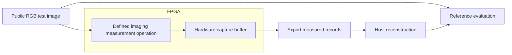

# RGB reconstruction with FPGA trace acquisition

Research review, 11 September 2026. Scope: small RGB images, up to 128 × 128, with acquisition inside the FPGA. This review combines repository evidence with primary literature. No FPGA was programmed, no new traces were captured, and no reconstruction method was benchmarked during this review.

The central finding is that acquisition and reconstruction need separate evidence. The repository has historical on-chip sensing and newer grayscale reconstruction experiments, but the newer grayscale experiments use an external capture instrument. Their results do not establish RGB reconstruction from an on-chip sensor.

For a deliberately instrumented imaging benchmark, the strongest initial comparison is regularized least squares, TV/wavelet reconstruction, and a supervised CNN. Deep Image Prior and diffusion are additional research comparisons. Applying any of these to physical side-channel observations is a separate, unproven proposition: those observations cannot simply be assumed to follow an ordinary imaging measurement model. Side-channel material here is limited to conceptual feasibility and evidence assessment.

**What the project currently establishes**

| Question | Evidence found | Consequence |
|---|---|---|
| Which board? | CW305-A100 / Artix-7 XC7A100T, with ChipWhisperer-Lite/CW1173 in the documented setup. [Hardware setup](C:/Users/narut/OneDrive/Desktop/Project/bnn/HARDWARE_SETUP.md:13). | This review assumes that board, without checking a live connection. |
| Are recent grayscale traces captured inside the target FPGA? | The August catch-up report identifies an external shunt path. [Acquisition discussion](C:/Users/narut/OneDrive/Desktop/Project/bnn/report/catchup_v2_2026-08-30/cw305_catchup.tex:1337). | Real hardware capture alone does not satisfy the stricter requirement of acquisition inside the target FPGA. |
| Does an on-chip channel already exist? | Historical RO measurements are documented separately, with limited recovery performance. [RO results](C:/Users/narut/OneDrive/Desktop/Project/bnn/RO_CHANNEL_RESULTS.md:8). | There is prior on-chip sensing work, but its existence does not validate an RGB acquisition pipeline. |
| Is that sensor already integrated into the grayscale design? | The August report describes that integration as future work; the sensor is in the BNN design. [Remaining work](C:/Users/narut/OneDrive/Desktop/Project/bnn/report/catchup_v2_2026-08-30/cw305_catchup.tex:1747). | Treat grayscale results and on-chip sensing as distinct experiments. |
| What image scale is demonstrated? | Inspected reports cover 28 × 28 MNIST/Fashion-MNIST, including binary and 8-bit grayscale inputs. [Grayscale experiments](C:/Users/narut/OneDrive/Desktop/Project/bnn/report/catchup_v2_2026-08-30/cw305_catchup.tex:613). | No RGB or 128 × 128 reconstruction result was found in the inspected documentation. |

These are findings from saved reports, not independent reproductions. Earlier explanatory claims about signal quality should also remain hypotheses unless supported by controlled measurements.

**What counts as extraction on the FPGA**

| Acquisition route | Where measurements originate | Meets acquisition inside the target FPGA? | What it establishes |
|---|---|---|---|
| Physical RO/TDC sensor | An on-chip physical sensor produces digital observations | Yes, if sensing and capture are actually implemented there | Physical observations of device behavior; RGB recoverability remains to be established |
| Intentionally exported measurement signals, captured by ILA or dedicated capture logic | Explicit digital signals in the FPGA design | Yes | An instrumented imaging or debug experiment; directly exported values are not evidence of recovery through physical leakage |
| XADC telemetry | The device's embedded ADC and monitoring circuitry | Yes | Analog/voltage/temperature telemetry with its own bandwidth and resolution limits |
| CW-Lite/external ADC observing the CW305 | A separate instrument digitizes the signal | No under the strict interpretation used here | External hardware acquisition, even if the workload runs on the FPGA |
| Host-generated or RTL-simulated traces | Software or simulation | No | Algorithm or functional validation only |

AMD describes ILA as monitoring internal design signals; it is a digital observation facility, not itself an analog power sensor. The 7-series XADC contains two 12-bit, 1 MSPS ADCs. That specification does not establish suitability for resolving individual accelerator operations or reconstructing RGB images. [AMD ILA guide](https://docs.amd.com/v/u/en-US/pg172-ila), [AMD XADC guide](https://docs.amd.com/r/en-US/ug480_7Series_XADC/Analog-to-Digital-Converter).

The standard CW305 external measurement arrangement is documented by its manufacturer. Its presence in a hardware experiment must not be described as target-FPGA acquisition. [NewAE CW305 documentation](https://chipwhisperer.readthedocs.io/en/v6.0.0b/Targets/CW305%20Artix%20FPGA.html).

Host reconstruction is consistent with the request: the stated hardware constraint applies to trace extraction. Requiring the reconstruction model itself to run on FPGA would be an additional resource and implementation task.

**RGB changes the information requirement**

An RGB image has three channel values per pixel. A measurement sensitive only to a combined brightness value generally does not identify all three original values. Different colors can produce the same brightness. More samples of the same ambiguous quantity do not automatically resolve that ambiguity.

Likewise, if preprocessing converts RGB to grayscale or thresholds it before the observed computation, exact original colors generally cannot be recovered from that computation alone. A model may produce plausible colors from prior experience, but that is not proof that the measurements determined those colors. This statement concerns information actually preserved at the observation point; it does not assume every BNN discards RGB at its input.

Reducing spatial dimensions helps storage and computation, but does not fix missing color information. Relative to one 28 × 28 grayscale image, a 128 × 128 RGB image contains about 62.7 times as many scalar channel values.

| Resolution | Scalar channel values | RGB8 frame storage | Float32 image storage on host |
|---|---:|---:|---:|
| 32 × 32 | 3,072 | 3 KiB | 12 KiB |
| 64 × 64 | 12,288 | 12 KiB | 48 KiB |
| 128 × 128 | 49,152 | 48 KiB | 192 KiB |

These are calculated image payload sizes, excluding traces, metadata, intermediate features and model weights. The XC7A100T has 135 nominal 36 Kb block RAMs, according to AMD. A 48 KiB image is modest compared with the device's total nominal memory capacity, but available memory and packing depend on the complete implemented design. Image size alone cannot establish that an acquisition design fits. [AMD 7-series overview, Artix-7 resource table](https://docs.amd.com/api/khub/documents/2LByHkO~nSZXcei2D55fTg/content).

**Reconstruction methods worth comparing**

The following comparison applies to deliberately defined imaging measurements: the relationship between the input image and exported observations is part of the benchmark. Rankings are engineering judgments, not measured results on this project.

| Method | Required information | Why consider it for small RGB images? | Main limitation | Suggested role |
|---|---|---|---|---|
| Regularized least squares / ridge | A known linear measurement operator | Interpretable baseline; exposes ambiguity and sensitivity without a learned image distribution | Cannot uniquely determine arbitrary images from insufficient measurements; regularization can smooth detail | First baseline |
| Total variation or wavelet sparsity | A defined observation model and an explicit structural prior | Useful classical comparison for edges, smooth regions and compressible image structure | Texture loss, smoothing artifacts, and dependence on measurement-model assumptions | Main classical comparison |
| Supervised CNN / U-Net family | Representative paired measurements and reference images; an explicit model is optional for a direct learned mapping | Can learn nonlinear reconstruction and shared RGB structure | Training dependence, domain shift and plausible but inaccurate detail; an arbitrary trace vector is not automatically an image-domain U-Net input | Main learned comparison once valid data exist |
| Deep Image Prior | A task-specific observation model; no external paired training set | Investigates what an untrained convolutional image prior can recover with limited training data | Optimization is required for each image; fitting can absorb corruption | Small-data comparison |
| Diffusion posterior sampling | A compatible pretrained image prior, forward model and noise assumptions | Explores reconstruction uncertainty and stronger image priors | Higher computational burden and approximate conditioning; visually plausible images can disagree with the original | Later exploratory comparison |

For ridge, the underlying principle is least-squares fitting with a penalty on the solution. It is useful because an attractive result from a complex model is difficult to interpret without a simpler baseline. Resource requirements depend strongly on whether the measurement operator has structure; small images do not make every dense inverse computation cheap. [Boyd and Vandenberghe, approximation and fitting](https://web.stanford.edu/class/ee364a/lectures/approx.pdf).

TV and wavelets are related baseline families, not identical algorithms. The original TV work concerns denoising with an edge-preserving prior. Sparse-recovery theory establishes guarantees only under assumptions about both the representation and measurement operator. Arbitrary physical sensor traces do not inherit those guarantees. [Rudin, Osher and Fatemi](https://www.sciencedirect.com/science/article/pii/016727899290242F), [Candès, Romberg and Tao](https://arxiv.org/abs/math/0503066).

For CNN methods, a useful primary example combines physical inversion with a residual convolutional network. Its demonstrated application is sparse-view CT, not FPGA side-channel RGB reconstruction. A three-channel small-image adaptation is a research proposal. [Jin et al., Deep Convolutional Neural Network for Inverse Problems in Imaging](https://arxiv.org/abs/1611.03679).

Deep Image Prior shows that a randomly initialized network can serve as an image prior for restoration without an external training dataset. It still needs a relationship between the candidate image and observations; “untrained” does not mean “no optimization.” [Ulyanov et al., Deep Image Prior](https://arxiv.org/abs/1711.10925).

Diffusion posterior sampling combines an image distribution with noisy linear or nonlinear measurement models. Its original contribution supports investigating the methodology, but supplies no accuracy guarantee for the present hardware or observations. [Chung et al., Diffusion Posterior Sampling](https://arxiv.org/abs/2209.14687).

Conventional side-channel template/statistical methods are another literature category, but success on a low-entropy binary or grayscale task cannot be extrapolated to full RGB recovery. They are not developed into an operational recovery workflow in this review.

**What the side-channel literature establishes**

The paper *Power Side-Channel Attacks on BNN Accelerators in Remote FPGAs* reports on-chip voltage observations using TDCs and recovery experiments on MNIST. This is precedent for physical observations originating on FPGA. It is not evidence of 128 × 128 RGB recovery, nor does it establish that this repository's RO sensor behaves like the paper's TDC implementation. [Original paper](https://arxiv.org/abs/2011.07603).

The USENIX 2024 systematization distinguishes objectives such as architecture, parameter and input extraction and discusses practical limitations on FPGA neural-network accelerators. It reinforces the need to match published evidence to the exact task and observation model. [Horváth et al., SoK: Neural Network Extraction Through Physical Side Channels](https://www.usenix.org/conference/usenixsecurity24/presentation/horvath).

No primary source checked in this review establishes an off-the-shelf method that guarantees RGB recovery from the current project's on-chip traces. This is a bounded literature finding, not a claim that no such research exists anywhere.

**A constructive experimental direction**

A separate, intentionally instrumented RGB imaging benchmark would let us compare reconstruction methods while satisfying the FPGA acquisition requirement. It answers a different question from recovering hidden inputs through physical side channels, so its results must be labeled accordingly.

Examples of a defined imaging operation include a declared sampling mask or an intentionally computed image transform. Exporting the full RGB image is useful for validating transport, but would only demonstrate readback. The original reference image should be available to evaluation, not silently passed into a supposedly measurement-only reconstruction stage.

For this instrumented benchmark, begin at 32 × 32 RGB, then consider 64 × 64 and 128 × 128 after the smaller experiment has credible hardware and reconstruction evidence. Compare ridge and TV/wavelets first, then the CNN family; reserve DIP and diffusion for investigating the contribution of image priors. This order reduces uncertainty about what has actually been measured before adding expensive models. It does not prescribe a side-channel extraction experiment.

Each result should identify whether its measurements came from physical FPGA execution, RTL simulation, or host computation. Preserve the programmed design identity, input dimensions, measurement format, captured sample count, capture completeness and acquisition source. A programmed bitstream without an observed capture is not an acquisition result.

Evaluate fidelity with RGB error, per-channel error and structural similarity; state the numerical range and color representation. Include difficult textures and color variation, not just recognizable silhouettes. For a known observation model, report agreement with the measurements as well as agreement with the reference image. Measurement agreement alone still does not prove uniqueness.

Training and evaluation images should be disjoint, with crops and variants of the same source grouped together. Distinguish reconstruction on familiar image distributions from generalization. Keep acquisition time, reconstruction time and memory separate. Report variation and failure cases; classifier recognition or a few attractive images do not establish pixel-accurate RGB reconstruction.

**Review record**

Objective: explore RGB reconstruction methodologies up to 128 × 128 while making the FPGA acquisition requirement explicit. New file: this review only. Evidence: saved hardware reports, manufacturer documentation, primary imaging papers and a scoped side-channel literature review; payload arithmetic checked locally. Limitations: no live hardware inspection, new captures, synthesis, training or quality measurements. Next concrete work within the instrumented-imaging direction: specify the public input format and intentional measurement relation before implementing an FPGA capture benchmark. Physical side-channel RGB feasibility remains unresolved.
